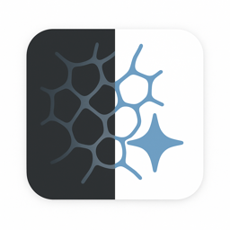

# Angio-CLEAN

[](https://github.com/FRJT-BIO/ANGIO-CLEAN/actions/workflows/build.yml)
[](LICENSE)

**A free, open-source ImageJ/Fiji plug-in that removes the halo artifact from angiogenesis assay images to improve automated quantification.**

Angio-CLEAN flattens the uneven background of in vitro angiogenesis images so that
automated tools (such as the Angiogenesis Analyzer for ImageJ) can quantify the
vascular network more accurately. It is the maintained successor of an earlier
`Angio-CLEAN.ijm` macro; **with default settings its output is pixel-identical to
that macro.**

<p align="center">
  
</p>

---

## Quick install (pre-built plugin)

1. Download **`Angio-CLEAN_.jar`** from the
   [latest release](https://github.com/FRJT-BIO/ANGIO-CLEAN/releases) (or from the `download_plugin/` folder).
2. Copy it into your **`ImageJ/plugins`** (or **`Fiji.app/plugins`**) folder.
3. Restart ImageJ/Fiji.
4. Run it from **Plugins > Angio-CLEAN...**

No compilation or dependencies required.

> **Compatibility:** the plug-in is built for **Java 8** (class file version 52),
> so it runs on ImageJ/Fiji installations bundling Java 8 or any newer Java.

---

## Usage

Open **Plugins > Angio-CLEAN...** and set:

| Field | Meaning |
|---|---|
| **Input directory** | Folder of images to process. *Leave empty to process the currently open image instead.* |
| **Output directory** | Where processed images are written (batch mode). |
| **Background method** | `Gaussian blur` (default), `Rolling ball`, or `Median`. |
| **Radius or sigma** | sigma for Gaussian, radius for the others (default **30**). |
| **Convert to 8-bit first** | On = original macro behaviour. Off = keep native bit depth (e.g. 16-bit). |
| **Result type** | `RGB` (macro default), `32-bit` (raw subtract), `8-bit`, or `Same as input`. |
| **Invert result** | Flip intensities (for dark-on-light vessels). |
| **Saturated pixels (%)** | Optional contrast stretch (0 = off). |
| **File format** | TIFF / PNG / JPEG. |
| **Filename suffix** | Appended to each output name (default `_processed`). |
| **Recursive subfolders** | Process sub-folders, mirroring the structure in the output. |
| **Skip existing outputs** | Don't reprocess files already produced. |
| **Process stacks** | Process each slice of multi-page images independently. |
| **Threads** | Parallel workers. Output is identical regardless of this value. |
| **CSV report / Run log / Embed metadata** | Reproducibility outputs (see below). |
| **Preview first image** | Show the first result and confirm before the whole batch. |

Supported inputs: `.tif .tiff .jpg .jpeg .png .bmp .gif`.
All settings are remembered between sessions.

### Algorithm

For each image (or slice):

1. *(optional)* convert to 8-bit;
2. estimate the background (Gaussian / rolling ball / median);
3. `result = image - background` in **32-bit** float;
4. *(optional)* invert, convert to the chosen output type, contrast-stretch;
5. save.

With defaults (`Gaussian`, sigma=30, 8-bit, RGB, TIFF) this reproduces
`Angio-CLEAN.ijm` exactly.

### Reproducibility outputs

Every batch run writes, in the output folder:

- `AngioCLEAN_report_<timestamp>.csv` - per-image status, size, type, min/max, time.
- `AngioCLEAN_run_<timestamp>.log` - full parameter set, software versions, per-file log.
- The exact parameters are also **embedded in each output image's metadata**
  (`Image > Show Info...` in ImageJ).

---

## Build from source

### Option A - Maven (standard ImageJ ecosystem)

```bash
mvn clean package
# -> target/Angio-CLEAN_-3.0.0.jar
```

If Maven says the parent version doesn't exist, set the `<version>` of
`pom-scijava` in `pom.xml` to the latest from
https://github.com/scijava/pom-scijava/releases .

### Option B - No Maven (self-contained script)

```bash
./build.sh
# -> Angio-CLEAN_.jar  (also produces ij.jar for tests)
```

`build.sh` fetches the dependency-free ImageJ1 source from GitHub, compiles it
into a local `ij.jar`, then builds the plugin (targeting Java 8). This is what
the CI uses.

### Tests

```bash
./build.sh
javac -cp ij.jar:Angio-CLEAN_.jar -d .test src/test/java/TestAngioV3.java
xvfb-run -a java -cp ij.jar:Angio-CLEAN_.jar:.test TestAngioV3
```

The suite checks (among others) that the default output is **pixel-identical**
to the original macro and that multi-threaded results match single-threaded.

---

## How to cite

Angio-CLEAN is free to use under the GPL-3.0 license. If you use it in work that
leads to a publication, please **also cite the original article describing the
plug-in**:

> Jimenez-Trinidad FR, Sardine A, et al. Angio-CLEAN: a user-friendly ImageJ
> plug-in for halo-artifact removal that improves automated angiogenesis
> quantification. **DOI: to be added upon publication.**

A [`CITATION.cff`](CITATION.cff) file is included, so GitHub shows a
**"Cite this repository"** button in the sidebar.

## License

[GNU General Public License v3.0](LICENSE) (c) 2024-2026 Francisco Rafael Jimenez
Trinidad and contributors.

## Acknowledgements

Built on [ImageJ](https://imagej.net) (Wayne Rasband, NIH). Originally derived
from the `Angio-CLEAN.ijm` macro.
